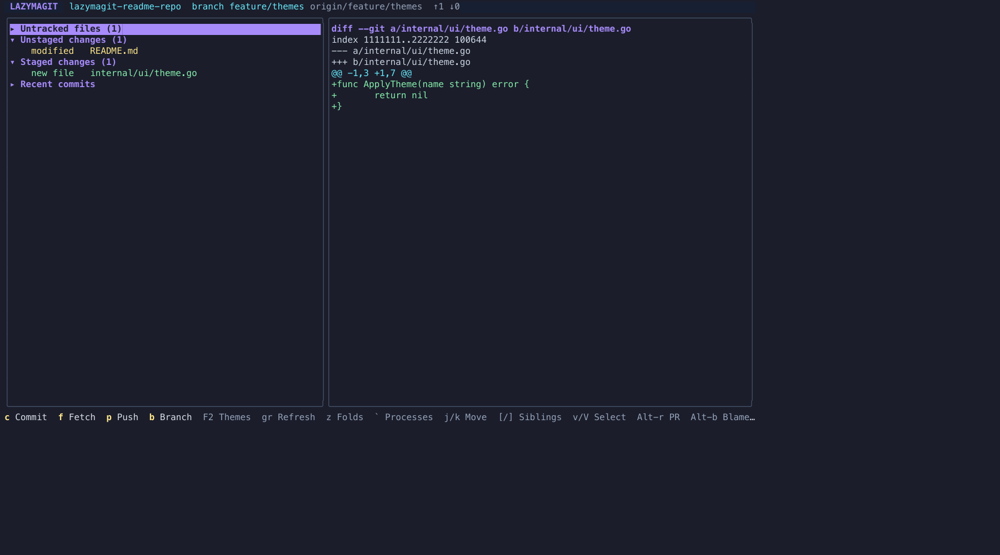
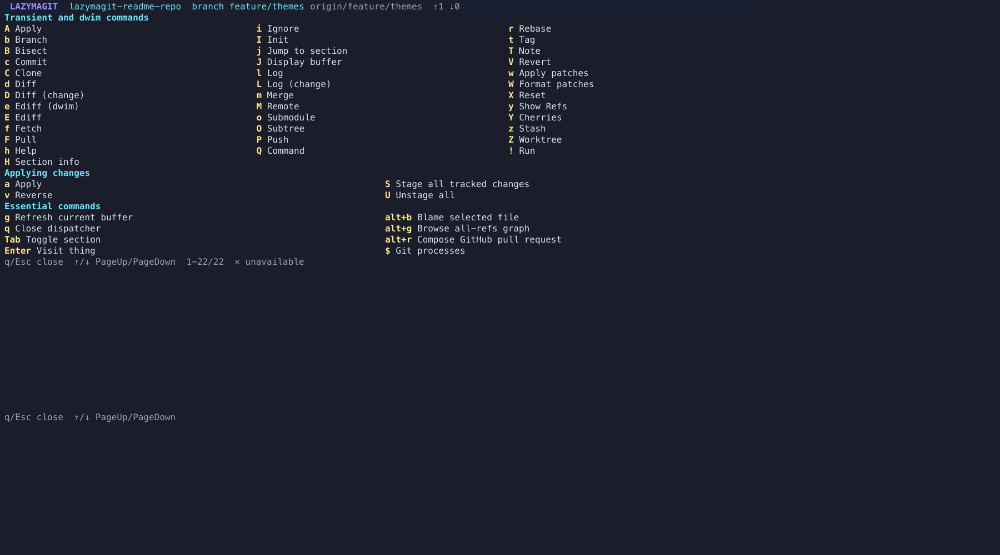

# lazymagit

A fast, keyboard-first Git client for the terminal. Lazymagit combines a
Magit-style status buffer with Doom/Evil-inspired navigation and review-first
safety for Git operations.


## Why lazymagit?

- **Magit workflow, terminal speed** — see and act on your entire working tree.
- **Safe by default** — review plans and re-check state before destructive work.
- **Precise changes** — stage, unstage, discard, and review files, hunks, or lines.
- **Complete workflow** — branches, remotes, worktrees, conflicts, history, and PRs.
- **Comfortable editing** — Vim-style commit and PR buffers with drafts and undo.

## Screenshots





## Install

### Go

```sh
go install github.com/richardrh/lazymagit/cmd/lazymagit@latest
```

### Release downloads

Download binaries or native Debian, RPM, and Arch packages from the
[latest GitHub release](https://github.com/richardrh/lazymagit/releases/latest).

## Run

```sh
lazymagit [repository]
```

Use `--init` to initialize a non-repository directory without prompting.

## Themes

Choose a theme at startup:

```sh
lazymagit --theme nord
```

From the status view, press `F2` to change themes. Use `↑`/`↓` or `j`/`k` to
move, `Enter` to apply, and `q`/`Esc` to cancel.

## Documentation

See the [documentation](docs/) for workflows, keybindings, and distribution
details. The Hugo site source is in [`doc/content/`](doc/content/).
